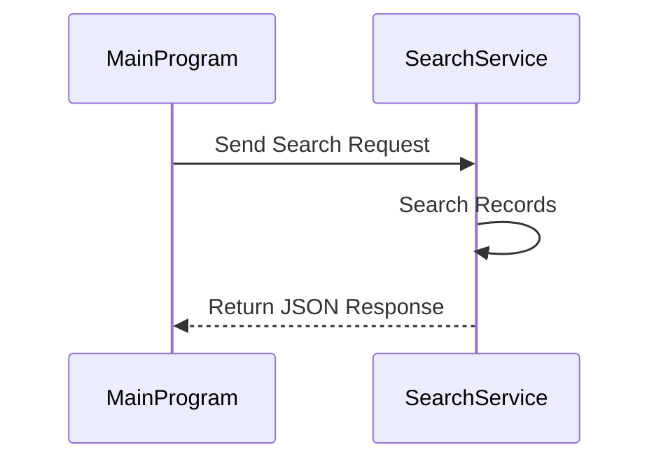

# Search Service Microservice

This microservice allows programs to search records by keyword and receive matching results in JSON format.

## Communication Pipe

REST API Using HTTP GET Requests And JSON Responses

## How To Request Data

Programs Send A GET Request To The /search Endpoint With A Keyword Parameter.

### Example Request

```text
GET http://localhost:5000/search?keyword=Policy
```

### Request Parameters

| Parameter | Description |
|---|---|
| keyword | Search Term Used To Find Matching Records |

## Example Python Request

```python
import requests

response = requests.get("http://localhost:5000/search?keyword=Policy")
print(response.json())
```

## How Data Is Returned

The Microservice Returns Matching Records In JSON Format.

## Example Response

```json
[
  {
    "id": 3,
    "type": "Policy Violation",
    "status": "Under Review"
  }
]
```

## UML Sequence Diagram



## How To Run

Install Required Packages:

```bash
pip install flask requests
```

Run The Microservice:

```bash
python search_service.py
```

Run The Test Program In Another Terminal:

```bash
python test_program.py
```
